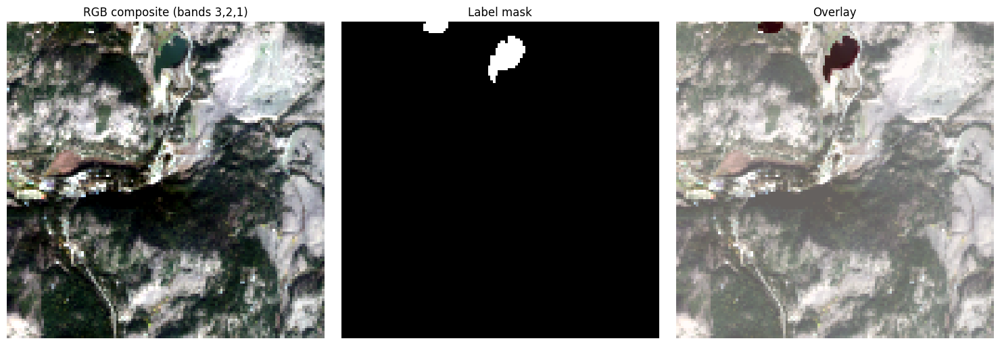
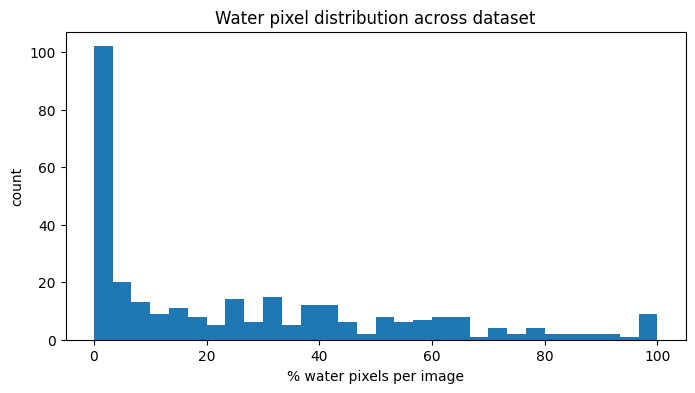
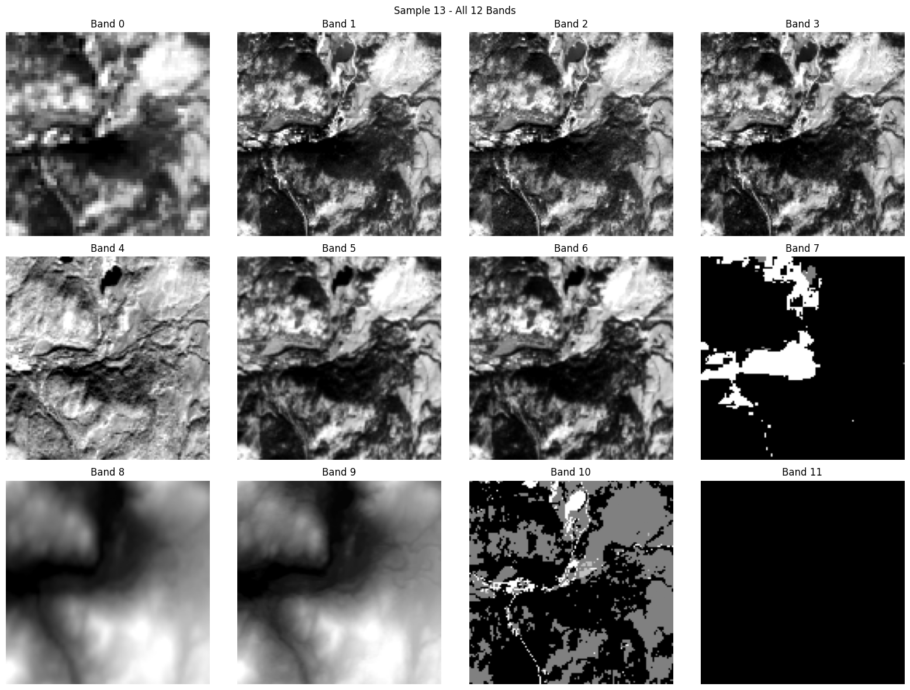
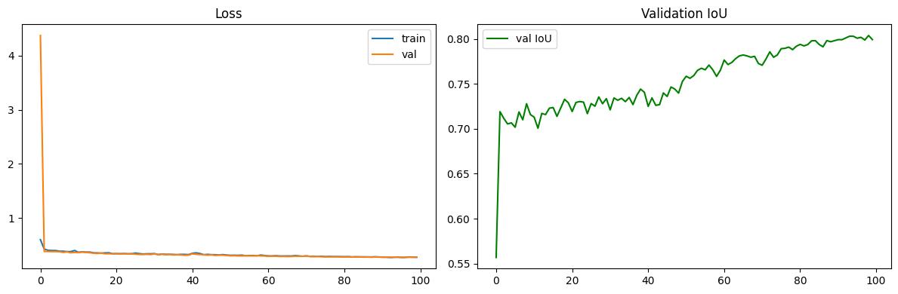
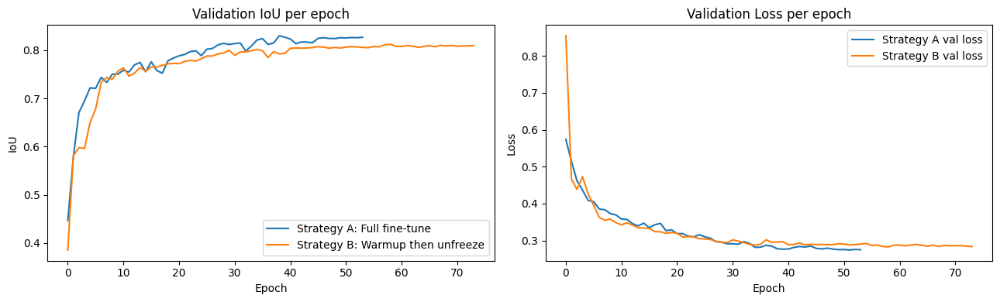
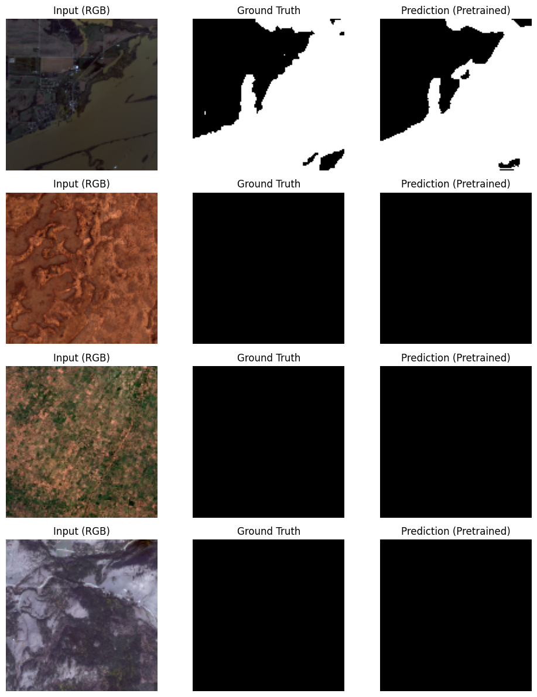

# Water Segmentation using Multispectral Satellite Imagery — A Comparative Study

A comparative study of two approaches to segmenting water bodies from 12-channel Sentinel-2/Landsat harmonized satellite imagery: a **U-Net built entirely from scratch** versus a **pretrained ResNet34 encoder fine-tuned** for the same task, using PyTorch and `segmentation-models-pytorch`.

| Model | IoU | F1-score | Precision | Recall |
|---|---|---|---|---|
| U-Net (from scratch) | 0.8039 | 0.8912 | 0.9033 | 0.8807 |
| **Pretrained ResNet34 U-Net (fine-tuned)** | **0.8299** | **0.9070** | **0.9154** | **0.9005** |

*(Best checkpoint on a held-out validation split, evaluated at a 0.5 probability threshold)*

The pretrained model improved validation IoU by **+0.0260** over the from-scratch baseline, using an identical dataset, split, loss function, and evaluation protocol.

---

## Table of Contents
- [Objective](#objective)
- [Dataset](#dataset)
- [Understanding the 12 Bands](#understanding-the-12-bands)
- [Preprocessing Pipeline](#preprocessing-pipeline)
- [Model 1: U-Net from Scratch](#model-1-u-net-from-scratch)
- [Model 2: Pretrained ResNet34 U-Net](#model-2-pretrained-resnet34-u-net)
- [Fine-Tuning Strategy Comparison](#fine-tuning-strategy-comparison)
- [Comparative Results](#comparative-results)
- [Discussion — Which Model Wins, and Why](#discussion--which-model-wins-and-why)
- [Repository Structure](#repository-structure)
- [How to Run](#how-to-run)
- [Notes & Observations](#notes--observations)
- [Resources](#resources)

---

## Objective

Segmenting water bodies accurately from satellite imagery supports flood monitoring, water resource management, and environmental conservation. This project builds a full pipeline — from raw multispectral `.tif` exploration to two trained, evaluated segmentation models — and directly compares a from-scratch architecture against a transfer-learning approach, using only 12-band satellite input.

## Dataset

- **306 samples**, each a 12-band `.tif` image paired with a binary water mask (`.png`).
- Image shape: `(12, 128, 128)`, dtype `int16`.
- Labels are strictly binary (`0` = background, `1` = water).
- Dataset is **not heavily imbalanced overall**: mean water coverage is ~26% of pixels per image, though 45/306 images (14.7%) contain no water at all — this informed the loss function choice (see below).
- Stratified 80/20 train/val split by water-presence: **244 train / 62 validation**, keeping the ~85% water-containing ratio consistent across both splits.

**Label file naming note:** the raw labels folder also contained files like `1_226.png`, `2_215.png` — auxiliary/duplicate exports not matching the clean `<id>.png` pattern. These were explicitly filtered out during dataset loading, keeping only the canonical `0.png, 1.png, 2.png, ...` labels, which matched 1:1 with all 306 image IDs (verified with zero mismatches).

<p align="center">
  
  <br>
  <em>RGB composite (bands 3,2,1), ground-truth mask, and overlay for a sample tile.</em>
</p>

<p align="center">
  
  <br>
  <em>Distribution of water-pixel percentage across the dataset (mean ≈ 26%, 45/306 images with 0% water).</em>
</p>

## Understanding the 12 Bands

Unlike standard RGB imagery, each `.tif` file is a **harmonized Sentinel-2 / Landsat stack** combining spectral bands with auxiliary geospatial layers:

| Index | Band | Type |
|---|---|---|
| 0 | Coastal aerosol | Spectral |
| 1 | Blue | Spectral (RGB) |
| 2 | Green | Spectral (RGB) |
| 3 | Red | Spectral (RGB) |
| 4 | NIR | Spectral |
| 5 | SWIR1 | Spectral |
| 6 | SWIR2 | Spectral |
| 7 | QA Band | Quality flag |
| 8 | Merit DEM | Elevation |
| 9 | Copernicus DEM | Elevation |
| 10 | ESA World Cover map | Land cover class |
| 11 | Water Occurrence Probability | Historical water frequency |

Bands 3, 2, 1 (Red, Green, Blue) form the natural-color composite used for visualization. **NIR and SWIR bands are the most informative for water detection**, since water strongly absorbs near-infrared and shortwave-infrared radiation, making it appear distinctly dark relative to land in those channels — the physical basis of indices like NDWI. Bands 8–11 are not spectral reflectance at all, but auxiliary rasters (elevation, land cover, historical water occurrence) that provide additional geographic context, not pixel colour. This distinction matters directly for the pretrained-model comparison below, since ImageNet pretraining has no prior exposure to non-photographic channels like these.

A per-band zero-check across the full dataset showed band 11 (Water Occurrence Probability) is entirely zero in 18.6% of images — expected for tiles with no historical water record — while all other bands are non-zero in every image.

<p align="center">
  
  <br>
  <em>All 12 bands visualized individually for one sample.</em>
</p>

## Preprocessing Pipeline

1. Read each `.tif` with `rasterio` → `(12, 128, 128)` array.
2. Compute **per-band mean and standard deviation** across the training split only (avoids validation leakage).
3. Apply per-band z-score normalization: `(x - mean) / std`.
4. Convert to `torch.float32` tensors, verified shape `(12, 128, 128)` for images and `(1, 128, 128)` for masks.
5. Stratified 80/20 train/val split (stratified by water-presence).

This identical preprocessing pipeline, split, loss function, and metric implementation is shared by **both** models below, ensuring the comparison isolates the effect of architecture/pretraining rather than data handling differences.

---

## Model 1: U-Net from Scratch

A standard U-Net encoder–decoder, implemented entirely from scratch in PyTorch:

- **Input:** 12 channels → **Output:** 1 channel (binary logits, sigmoid applied at inference/eval)
- 4 downsampling stages (double conv + maxpool), a bottleneck, and 4 upsampling stages (transposed conv + skip connections via channel concatenation)
- Base channel width: 64 → 1024 at the bottleneck
- Kaiming (He) weight initialization
- **No pretrained weights** — trained entirely from random initialization
- **31,048,705** total trainable parameters

### Training Setup

| Setting | Value |
|---|---|
| Loss | BCEWithLogitsLoss + Dice Loss (0.5 / 0.5 weighted) |
| Optimizer | Adam, initial LR = 1e-3 |
| LR Scheduler | ReduceLROnPlateau (factor 0.5, patience 3, monitored on val loss) |
| Batch size | 16 |
| Epochs | 100 |
| Evaluation threshold | 0.5 (sigmoid probability) |

### Result: IoU 0.8039, F1 0.8912

<p align="center">
  
  <br>
  <em>From-scratch U-Net — training/validation loss and validation IoU across 100 epochs.</em>
</p>

<p align="center">
  
  <br>
  <em>From-scratch U-Net — qualitative predictions vs. ground truth on validation samples.</em>
</p>

---

## Model 2: Pretrained ResNet34 U-Net

Built using [`segmentation-models-pytorch`](https://github.com/qubvel-org/segmentation_models.pytorch), which allows loading a pretrained encoder (ResNet34, ImageNet weights) with a U-Net decoder, and natively supports non-RGB input via the `in_channels` argument.

```python
model = smp.Unet(
    encoder_name="resnet34",
    encoder_weights="imagenet",
    in_channels=12,
    classes=1,
    activation=None,
)
```

**Adapting the first layer to 12 channels:** when `in_channels != 3`, SMP does not randomly reinitialize the first convolution — it takes the pretrained 3-channel ImageNet weights and replicates/tiles them cyclically across the requested channel count, then rescales. This preserves useful low-level pretrained filters (edges, gradients, textures) as a starting point for all 12 channels, rather than initializing the extra 9 channels from random noise.

- **24,464,593** total trainable parameters (fewer than the scratch U-Net — ResNet34 is a lighter encoder than the from-scratch model's symmetric 64→1024 channel progression)

---

## Fine-Tuning Strategy Comparison

Two fine-tuning strategies were trained and compared on identical data/hyperparameters wherever possible, to determine the better approach for this dataset before finalizing Model 2's headline result:

- **Strategy A — Full fine-tuning:** the entire model (encoder + decoder) is unfrozen and trained end-to-end from epoch 1, LR = 1e-4.
- **Strategy B — Encoder-frozen warmup, then unfreeze:** the pretrained encoder is frozen for the first 5 epochs (training only the randomly-initialized decoder), then unfrozen and fine-tuned at a reduced LR.

| Strategy | Best Validation IoU |
|---|---|
| **A — Full fine-tuning** | **0.8299** |
| B — Frozen-encoder warmup, then unfreeze | 0.8122 |

**Strategy A (full fine-tuning) won**, by a margin of +0.0177 IoU over Strategy B. This is a useful finding worth noting: the "safer" transfer-learning convention of warming up the decoder before unfreezing the encoder did *not* pay off here — likely because the fine-tuning learning rate (1e-4) was already conservative enough to avoid destroying pretrained encoder features, making the extra protection from freezing unnecessary, while also slowing down the decoder's ability to learn jointly with the encoder from the start.

<p align="center">
  
  <br>
  <em>Validation IoU and loss per epoch for both fine-tuning strategies. Both used early stopping (patience 15 epochs on val IoU).</em>
</p>

Model 2's headline results (table below) use the Strategy A checkpoint, as the better-performing configuration.

<p align="center">
  
  <br>
  <em>Pretrained ResNet34 U-Net (Strategy A) — qualitative predictions vs. ground truth on validation samples.</em>
</p>

---

## Comparative Results

| Model | Parameters | IoU | F1-score | Precision | Recall |
|---|---|---|---|---|---|
| U-Net (from scratch) | 31,048,705 | 0.8039 | 0.8912 | 0.9033 | 0.8807 |
| **Pretrained ResNet34 U-Net (Strategy A)** | 24,464,593 | **0.8299** | **0.9070** | **0.9154** | **0.9005** |

The pretrained model achieves a **measurably higher IoU (+0.0260)** and higher scores across every metric, while using roughly **21% fewer parameters** than the from-scratch U-Net.

## Discussion — Which Model Wins, and Why

**The pretrained ResNet34 U-Net wins on every metric.** A few points explain why, and where the comparison is more nuanced than "pretraining always helps":

- **Low-level feature transfer:** ImageNet-pretrained filters (edge detectors, gradient operators, texture responses) transfer reasonably well to the RGB-like bands (Red, Green, Blue) and, to a lesser extent, to NIR/SWIR, which share spatial/textural structure with natural images despite differing wavelengths.
- **Small dataset regime:** with only 244 training images, a from-scratch 31M-parameter U-Net has to learn all of its representations — including basic edge/texture detectors — purely from this small dataset. The pretrained model starts several steps ahead on that front.
- **Auxiliary bands are a genuine mismatch:** bands 8–11 (DEM, land cover, water occurrence) are not photographic data at all — replicated ImageNet filters have no real prior relevance there. That the pretrained model still wins overall suggests the benefit gained on the RGB/NIR/SWIR bands outweighs the cost of a poorer starting point on the auxiliary bands, but this asymmetry is worth further investigation (e.g., per-band ablations) if extending this study.
- **Fine-tuning schedule matters as much as the backbone choice:** the gap between Strategy A (0.8299) and Strategy B (0.8122) is nearly two-thirds the size of the scratch-vs-pretrained gap itself (+0.0260). Choosing *how* to fine-tune a pretrained model is not a minor implementation detail — it materially affects the outcome.

**Practical takeaway:** for this water segmentation task, the pretrained ResNet34 U-Net with full end-to-end fine-tuning (Strategy A) is the recommended model — it's simultaneously more accurate and lighter in parameter count than the from-scratch alternative.

---

## Repository Structure

```
water-segmentation/
├── README.md
├── images/
│   ├── band_visualization.png
│   ├── rgb_mask_overlay.png
│   ├── water_distribution.png
│   ├── training_curves_scratch.png
│   ├── prediction_samples_scratch.png
│   ├── finetune_strategy_comparison.png
│   └── prediction_samples_pretrained.png
└── water-segmentation-using-multispectral-data-study.ipynb
```

## How to Run

1. Clone the repo and open the notebook in Jupyter, Kaggle, or Colab (GPU recommended).
2. Install dependencies:
   ```bash
   pip install rasterio torch torchvision scikit-learn matplotlib pillow numpy segmentation-models-pytorch
   ```
3. Update `IMAGES_DIR` and `LABELS_DIR` at the top of the notebook to point to your local dataset paths.
4. Run all cells sequentially — the notebook covers dataset exploration, preprocessing, both model definitions, training (scratch U-Net, then both pretrained fine-tuning strategies), and the final comparison end-to-end.
5. Checkpoints saved during training:
   - `best_unet_water_seg.pth` — from-scratch U-Net
   - `best_pretrained_full_finetune.pth` — Strategy A (winning pretrained checkpoint)
   - `best_pretrained_warmup_finetune.pth` — Strategy B

## Notes & Observations

- **BatchNorm warm-up artifact:** a brief validation loss spike at the very first epoch of training (both models) is a normal BatchNorm warm-up effect and resolves immediately by epoch 2 — not indicative of a bug.
- **Label filename filtering:** files with an underscore suffix in the labels folder (e.g. `1_226.png`) were deliberately excluded, as they didn't correspond to the canonical per-image label set.
- **Early stopping:** the from-scratch U-Net was trained for the full 100 epochs (validation IoU plateaus well before epoch 100 in practice). Both pretrained fine-tuning strategies used early stopping with patience 15 epochs on validation IoU, and stopped at epoch 54 (Strategy A) and epoch 74 (Strategy B) respectively.
- **Data augmentation was evaluated and reverted:** spatially-synchronized flip/rotation augmentation (with separate pixel-level jitter for brightness/contrast/noise, applied image-only) was implemented and tested, but measurably decreased validation IoU on this dataset and was reverted. A plausible explanation: with only 244 training images and 12 channels including non-photographic auxiliary bands (DEM, land cover, water occurrence), aggressive per-band pixel jitter across all channels likely introduced unrealistic variation for those specific bands, adding noise to the learning signal rather than improving generalization.
- **Reproducibility:** per-band normalization statistics are computed strictly from the training split to avoid validation leakage; the same random seed (42) is used for the train/val split across both models.

## Resources

- [U-Net: Convolutional Networks for Biomedical Image Segmentation](https://arxiv.org/abs/1505.04597)
- [ESRI — Near Infrared (GIS Dictionary)](https://support.esri.com/en-us/gis-dictionary/near-infrared)
- [ScienceDirect — Multispectral segmentation reference](https://www.sciencedirect.com/science/article/abs/pii/S0924271619301522)
- [Sentinel Hub — SWIR/RGB Custom Script](https://custom-scripts.sentinel-hub.com/custom-scripts/sentinel-2/swir-rgb/)
- [USGS — Landsat 8-9 Surface Reflectance Quality Assessment](https://www.usgs.gov/landsat-missions/landsat-8-9-surface-reflectance-quality-assessment)
- [Rethinking Atrous Convolution for Semantic Image Segmentation (DeepLabV3)](https://arxiv.org/abs/1606.00915)
- [segmentation_models.pytorch (qubvel)](https://github.com/qubvel-org/segmentation_models.pytorch)

---

*Built by Menna Thabet @ Cellula Technologies*
