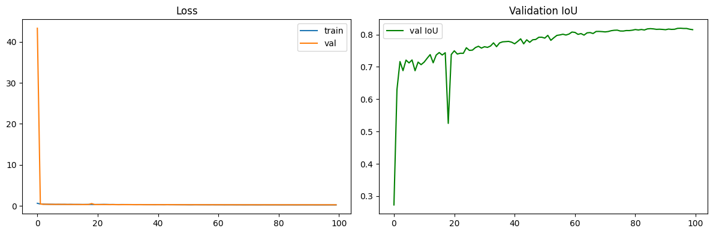
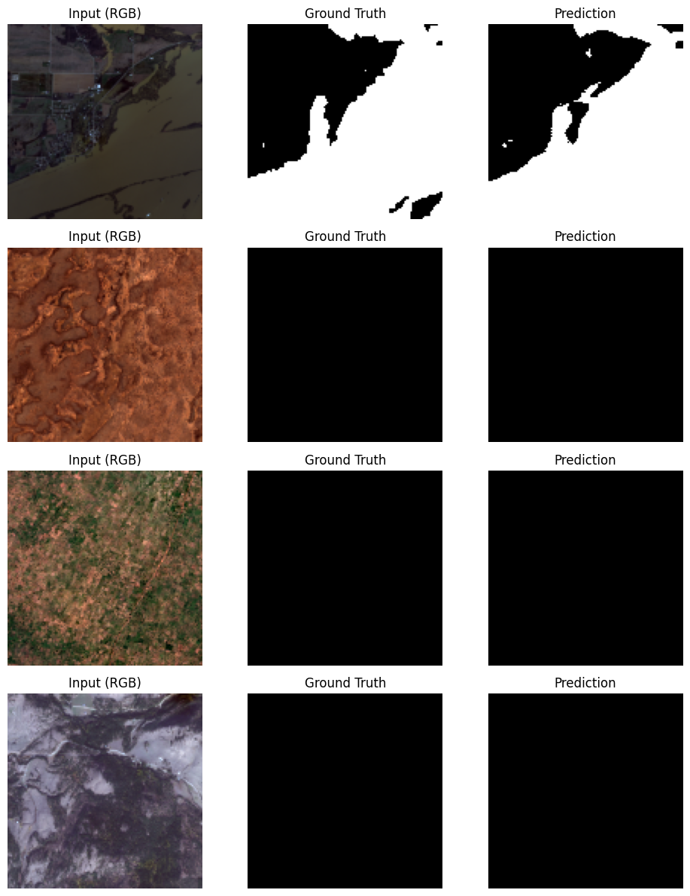

# Water Segmentation using Multispectral Satellite Imagery

A U-Net model, implemented from scratch in PyTorch, that segments water bodies from 12-channel Sentinel-2/Landsat harmonized satellite imagery.

| Metric | Score |
|---|---|
| **IoU** | **0.8197** |
| **F1-score** | 0.9008 |
| **Precision** | 0.9177 |
| **Recall** | 0.8856 |

*(Best checkpoint on a held-out validation split, evaluated at a 0.5 probability threshold)*

---

## Table of Contents
- [Objective](#objective)
- [Dataset](#dataset)
- [Understanding the 12 Bands](#understanding-the-12-bands)
- [Preprocessing Pipeline](#preprocessing-pipeline)
- [Model Architecture](#model-architecture)
- [Training Setup](#training-setup)
- [Results](#results)
- [Repository Structure](#repository-structure)
- [How to Run](#how-to-run)
- [Notes & Observations](#notes--observations)
- [Resources](#resources)

---

## Objective

Segmenting water bodies accurately from satellite imagery supports flood monitoring, water resource management, and environmental conservation. This project builds a full pipeline — from raw multispectral `.tif` exploration to a trained, evaluated segmentation model — using only 12-band satellite input and a U-Net built entirely from scratch (no pretrained weights).

## Dataset

- **306 samples**, each a 12-band `.tif` image paired with a binary water mask (`.png`).
- Image shape: `(12, 128, 128)`, dtype `int16`.
- Labels are strictly binary (`0` = background, `1` = water).
- Dataset is **not heavily imbalanced overall**: mean water coverage is ~26% of pixels per image, though 45/306 images (14.7%) contain no water at all — this informed the loss function choice (see below).

**Label file naming note:** the raw labels folder also contained files like `1_226.png`, `2_215.png` — auxiliary/duplicate exports not matching the clean `<id>.png` pattern. These were explicitly filtered out during dataset loading, keeping only the canonical `0.png, 1.png, 2.png, ...` labels, which matched 1:1 with all 306 image IDs (verified with zero mismatches).

<p align="center">
  
  <br>
  <em>RGB composite (bands 3,2,1), ground-truth mask, and overlay for a sample tile.</em>
</p>

<p align="center">
  
  <br>
  <em>Distribution of water-pixel percentage across the dataset.</em>
</p>

## Understanding the 12 Bands

Unlike standard RGB imagery, each `.tif` file is a **harmonized Sentinel-2 / Landsat stack** combining spectral bands with auxiliary geospatial layers:

| Index | Band | Type |
|---|---|---|
| 0 | Coastal aerosol | Spectral |
| 1 | Blue | Spectral (RGB) |
| 2 | Green | Spectral (RGB) |
| 3 | Red | Spectral (RGB) |
| 4 | NIR | Spectral |
| 5 | SWIR1 | Spectral |
| 6 | SWIR2 | Spectral |
| 7 | QA Band | Quality flag |
| 8 | Merit DEM | Elevation |
| 9 | Copernicus DEM | Elevation |
| 10 | ESA World Cover map | Land cover class |
| 11 | Water Occurrence Probability | Historical water frequency |

Bands 3, 2, 1 (Red, Green, Blue) form the natural-color composite used for visualization. **NIR and SWIR bands are the most informative for water detection**, since water strongly absorbs near-infrared and shortwave-infrared radiation, making it appear distinctly dark relative to land in those channels — the physical basis of indices like NDWI. Bands 8–11 are not spectral reflectance at all, but auxiliary rasters (elevation, land cover, historical water occurrence) that provide additional geographic context, not pixel colour.

A per-band zero-check across the full dataset showed band 11 (Water Occurrence Probability) is entirely zero in 18.6% of images — expected for tiles with no historical water record — while all other bands are non-zero in every image.

<p align="center">
  
  <br>
  <em>All 12 bands visualized individually for one sample.</em>
</p>

## Preprocessing Pipeline

1. Read each `.tif` with `rasterio` → `(12, 128, 128)` array.
2. Compute **per-band mean and standard deviation** across the training split only (avoids validation leakage).
3. Apply per-band z-score normalization: `(x - mean) / std`.
4. Convert to `torch.float32` tensors, verified shape `(12, 128, 128)` for images and `(1, 128, 128)` for masks.
5. Stratified 80/20 train/val split (stratified by water-presence, to keep the ~85% water-containing ratio consistent across both splits).

## Model Architecture

A standard U-Net encoder–decoder, implemented from scratch in PyTorch:

- **Input:** 12 channels → **Output:** 1 channel (binary logits, sigmoid applied at inference/eval)
- 4 downsampling stages (double conv + maxpool), a bottleneck, and 4 upsampling stages (transposed conv + skip connections via channel concatenation)
- Base channel width: 64 → 1024 at the bottleneck
- Kaiming (He) weight initialization
- **No pretrained weights** — trained entirely from random initialization
- **31,048,705** total trainable parameters

The encoder–decoder structure with skip connections preserves both high-level semantic context (from the deep bottleneck) and fine spatial detail (from the shallow encoder layers passed through skip connections) — essential for pixel-accurate segmentation of irregularly shaped water bodies.

## Training Setup

| Setting | Value |
|---|---|
| Loss | BCEWithLogitsLoss + Dice Loss (0.5 / 0.5 weighted) |
| Optimizer | Adam, initial LR = 1e-3 |
| LR Scheduler | ReduceLROnPlateau (factor 0.5, patience 3, monitored on val loss) |
| Batch size | 16 |
| Epochs | 100 |
| Evaluation threshold | 0.5 (sigmoid probability) |
| Hardware | GPU (CUDA) |

A combined BCE + Dice loss was chosen over plain BCE to better handle the meaningful minority of water-absent and low-water-coverage images without needing aggressive class weighting.

## Results

<p align="center">
  
  <br>
  <em>Training/validation loss and validation IoU across 100 epochs.</em>
</p>

Validation IoU rises quickly in the first ~10 epochs, then improves gradually with minor oscillation, reaching its best value of **0.8197** late in training. Training loss continued decreasing slightly faster than validation loss toward the end, indicating training could plausibly benefit from early stopping in future runs (see [Notes](#notes--observations)).

<p align="center">
  
  <br>
  <em>Qualitative predictions vs. ground truth on validation samples — including correctly predicted irregular water boundaries and correctly predicted all-dry tiles.</em>
</p>

## Repository Structure

```
water-segmentation/
├── README.md
├── images/
│   ├── Harmonized Sentinel-2 Landsat.jpeg
│   ├── band_visualization.png
│   ├── rgb_mask_overlay.png
│   ├── water_distribution.png
│   ├── training_curves.png
│   └── prediction_samples.png
└── water-segmentation-using-multispectral-and-optical.ipynb
```

## How to Run

1. Clone the repo and open the notebook in Jupyter, Kaggle, or Colab.
2. Install dependencies:
   ```bash
   pip install rasterio torch torchvision scikit-learn matplotlib pillow numpy
   ```
3. Update `IMAGES_DIR` and `LABELS_DIR` at the top of the notebook to point to your local dataset paths.
4. Run all cells sequentially — the notebook covers dataset exploration, preprocessing, model definition, training, and evaluation end-to-end.
5. The trained checkpoint is saved as `best_unet_water_seg.pth` during training.

## Notes & Observations

- **Band 7 anomaly at epoch 1:** a brief validation loss spike at the very first epoch is a normal BatchNorm warm-up artifact and resolves immediately by epoch 2 — not indicative of a bug.
- **Label filename filtering:** files with an underscore suffix in the labels folder (e.g. `1_226.png`) were deliberately excluded, as they didn't correspond to the canonical per-image label set.
- **Early stopping:** the current run trains for the full 100 epochs. Since validation IoU plateaus well before epoch 100 in practice, adding early stopping (patience ~15–20 epochs on val IoU) is a reasonable efficiency improvement for future runs, without materially changing the final result.
- **Reproducibility:** per-band normalization statistics are computed strictly from the training split to avoid validation leakage.

## Resources

- [U-Net: Convolutional Networks for Biomedical Image Segmentation](https://arxiv.org/abs/1505.04597)
- [ESRI — Near Infrared (GIS Dictionary)](https://support.esri.com/en-us/gis-dictionary/near-infrared)
- [ScienceDirect — Multispectral segmentation reference](https://www.sciencedirect.com/science/article/abs/pii/S0924271619301522)
- [Sentinel Hub — SWIR/RGB Custom Script](https://custom-scripts.sentinel-hub.com/custom-scripts/sentinel-2/swir-rgb/)
- [USGS — Landsat 8-9 Surface Reflectance Quality Assessment](https://www.usgs.gov/landsat-missions/landsat-8-9-surface-reflectance-quality-assessment)

---

*Built by Menna Thabet @ Cellula Technologies*
